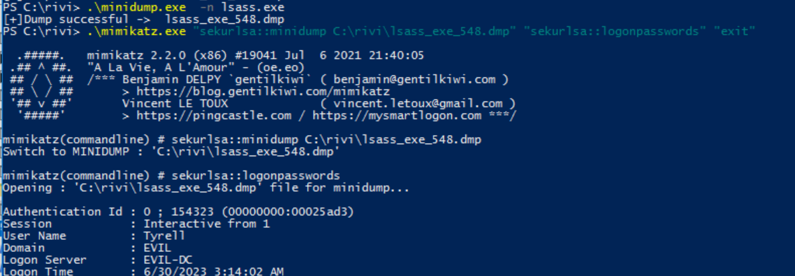

# go-minidump
   

## Description

tool for dump process full memory(default lsass.exe)

## Getting Started
```
make build
```
then, binary in /build.
## Usage
```
Usage: minidump.exe -f <file name> -p <process id> -n <process name>
```

## Help

Any advise for common problems or issues.
```
command to run if program contains helper info
```

## Authors
Contributors names and contact info
@mizuirorivi
